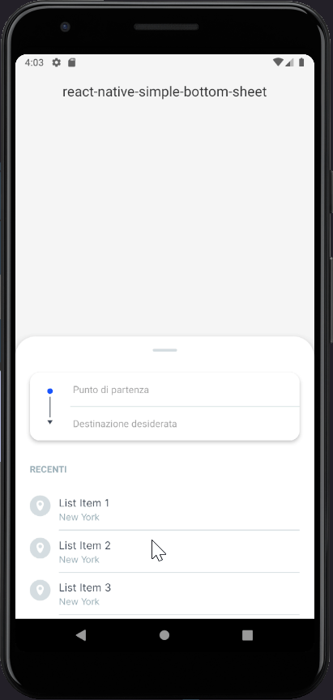
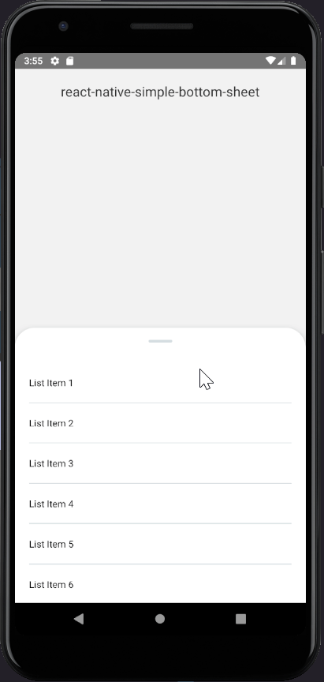
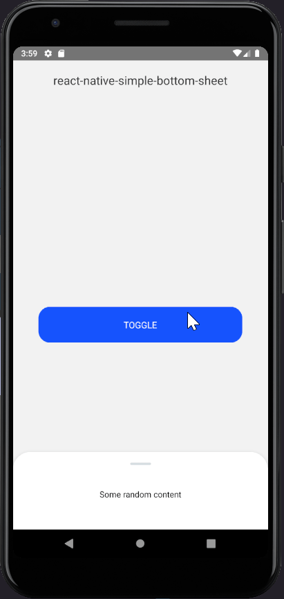
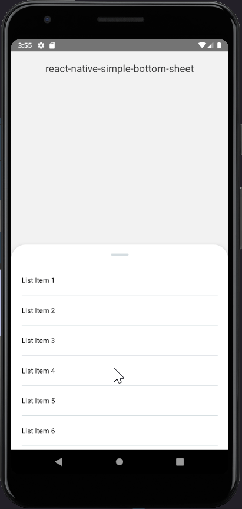

# react-native-slider-panel

Simple React Native component to display a draggable panel from the bottom of the screen

 Example 1                 | Example 2                 | Example 3
:-------------------------:|:-------------------------:|:-------------------------:
    |    | 


## Table of Contents

* [Installation](#installation)
* [Usage](#usage)
* [Props](#props)
* [Methods](#methods)

## Installation

`npm i --save react-native-slider-panel`

## Usage

```javascript
import SliderPanel from 'react-native-slider-panel';

function App() {
  return (
    <View style={{flex: 1}}>
      <View>Your content</View>
      <SliderPanel isOpen>
        // The component to render inside the panel
        <View />
      </SliderPanel>
    </View>
  );
}
```

By default the height of the panel tries to adapt to the content height till the `sliderMaxHeight` value is reached.<br />
If you want the content to scroll inside the panel use `ScrollView`/`FlatList` like this:

```javascript
function App() {
  return (
    <View style={{flex: 1}}>
      <View>Your content</View>
      <SliderPanel isOpen>
        {(onScrollEndDrag) => (
          <ScrollView onScrollEndDrag={onScrollEndDrag}>
            {[...Array(10)].map((_, index) => (
              <View key={`${index}`} style={styles.listItem}>
                <Text>{`List Item ${index + 1}`}</Text>
              </View>
            ))}
          </ScrollView>
        )}
      </SliderPanel>
    </View>
  );
}
```

This allows the panel to close when the user reaches the top of the scrollable content and drags the panel down again. Example:

<br />
<p align="center">
  
</p>
<br /><br />

By default when the panel is closed you can drag it up again thanks to the part of the panel that remains
on the bottom side of the screen. If you want to completely hide it you can set the `sliderMinHeight` prop
to `0` and use the `togglePanel` method to bring it up.

```javascript
function App() {
  const panelRef = useRef(null);

  return (
    <View style={{flex: 1}}>
      <View>Your content</View>
      <TouchableOpacity onPress={() => panelRef.current.togglePanel()}>
        <Text>Toggle</Text>
      </TouchableOpacity>
      <SliderPanel ref={ref => panelRef.current = ref}>
        <Text style={{paddingVertical: 20}}>
          Some random content
        </Text>
      </SliderPanel>
    </View>
  );
}
```

<br />
<p align="center">
  
</p>
<br />

## Props
| Prop Name          | Type        | Default                                 | Description                                                                                                                                                                              |
|--------------------|-------------|-----------------------------------------|------------------------------------------------------------------------------------------------------------------------------------------------------------------------------------------|
| children           | func or node | `<View />`                                  | A component or a render function. Use toggleSlider function instead                                                                                                                                  |
| isOpen             | boolean     | `true`                                  | Initial state of the panel; true to render it opened, false otherwise. **Important: Do not try to open/close the panel througth this prop, see** `togglePanel` **method instead** |
| sliderMinHeight    | number      | `50`                                    | Min height of the panel                                                                                                                                                                  |
| sliderMaxHeight    | number      | `Dimensions.get('window').height * 0.5` | Max height of the panel                                                                                                                                                                  |
| animation          | func        | `Easing.quad`                           | The close/open animation of the panel                                                                                                                                                    |
| animationDuration  | number      | `200`                                   | How long the panel takes to open/close                                                                                                                                                   |
| onOpen             | function    | `() => null`                            | Function to execute when the panel is opened                                                                                                                                             |
| onClose            | function    | `() => null`                            | Function to execute when the panel is closed                                                                                                                                             |
| wrapperStyle       | object      | `{}`                                    | Custom style for the panel wrapper                                                                                                                                                       |
| outerContentStyle  | object      | `{}`                                    | Custom style for the outer content                                                                                                                                                       |
| innerContentStyle  | object      | `{}`                                    | Custom style for the inner content                                                                                                                                                       |
| lineContainerStyle | object      | `{}`                                    | Custom style for the line container                                                                                                                                                      |
| lineStyle          | object      | `{}`                                    | Custom style for the line                                                                                                                                                                |

## Methods

| Name         | Description                      |
|--------------|----------------------------------|
| togglePanel  | Function to close/open the panel |

## License

<a href="./LICENSE.md">MIT</a>

## Author

Made by <a href="https://github.com/StefanoMartella">Stefano Martella</a>